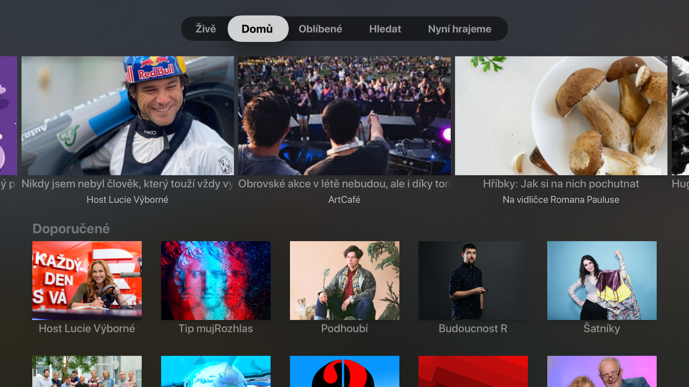

# cro_tvos

Neoficialni klient pro mujrozhlas.cz pro Apple TV

### Podekovani

- [atvjs](https://github.com/emadalam/atvjs) - Blazing fast Apple TV application development using pure JavaScript
- [ivysilani_tvOS](https://github.com/MarhyCZ/ivysilani_tvOS) - Neoficiální klient iVysílání pro sledování videoobsahu veřejnoprávní České televize na Apple TV
- [GCDWebServer](https://github.com/swisspol/GCDWebServer) - The #1 HTTP server for iOS, macOS & tvOS (also includes web based uploader & WebDAV server)
